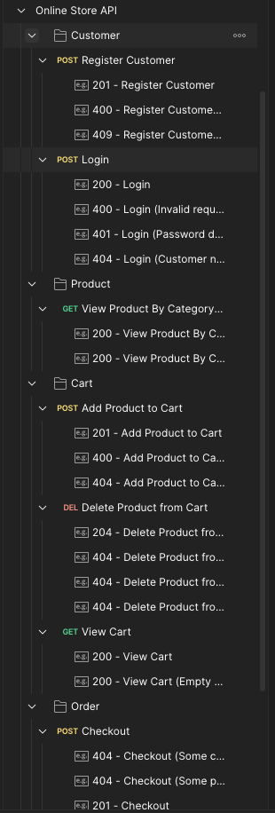

# Online Store API
Online Store API by Ahmad Dzaki Naufal.

## Tech Stack
- Go v1.22.
- PostgreSQL 14.10.
- Docker (Because we need to upload this Go app docker image to docker hub).

## How to Start
- Clone this repo.
- Copy file `params/.env.sample` to `params/.env`.
- Modify `params/.env` as your needs (current all config values in .env file are the default values for docker compose config & env, so you can build up this project docker containers without needs to change the existing .env values).
- Run `docker-compose up --build -d`. It will build up all of these project's dependencies (Go App & PostgreSQL db).
- Wait a few minutes until all the docker containers are up. The app and database will run on 1323 and 5432 ports for the default.
- There are [definition.sql](database/definition.sql) and [seeds.sql](database/seeds.sql) to help you build and seed the database. By default, these files will be executed in `docker-compose up` command

## About the Project
This project uses Clean Architecture Concept (modified) and [Echo Go Framework](https://echo.labstack.com/docs)

### Assumptions
- Term of user is just customer, so we do not have any seller users because I assumed this store is owned only by one person/group.
- All the product prices must be in integer not float.
- Payment flow is outside the scope. So after user checkout, the payment can be assumed as `paid` and the order will be immediately made and in `PENDING` status.
- A customer can own only one address.
- A customer can own only one active cart (not cart item).
- A valid password have a minimum 6 characters.
- Delete product endpoint is just only to delete a product/cart item in the cart. So it will not empty the cart.
- Get products by category is the user has seen the product category list page and when selected, the frontend will only send the category ID.
- In the registration process, there is a process for creating a cart for the first time for the user which is carried out asynchronously. if it fails, it can be handled at the add product endpoint.

## API Information
1. Health Check: GET / (will return string “OK!”)
2. Login for Customer: POST /customers/login
   - No Auth.
   - JSON request body required.
3. Register for Customer: POST /customers/register
   - No Auth.
   - JSON request body required.
4. Get Product List by Product Category ID: GET /products/categories/:category_id
   - No Auth.
   - JSON request body required.
5. Add a Product to Cart: POST /carts
   - Authentication: Bearer token (JWT).
   - JSON request body required.
   - Can add a new product that is not yet in the cart or is already in the cart.
6. Delete a Product from Cart: DELETE /carts/:product_id
   - Authentication: Bearer token (JWT).
   - Delete an existing product from user cart. If after the deletion process the user cart is empty, it will not delete the cart and just leave it to empty.
7. View User Cart: GET /carts
   - Authentication: Bearer token (JWT).
   - There is a URL query param `next` for next page token because this endpoint only returns 10 data per request (I used pagination feature).
8. User Checkout: POST /orders
   - Authentication: Bearer token (JWT).
   - If after the checkout process the user cart is empty, it will not delete the cart and just leave it to empty.

For more detailed API information, you can import this project [Postman Collection](documents/postman/Online Store API.postman_collection.json) to your Postman Collection/Workspace because I use Postman rather than Swagger.
There is most of each this API endpoint example in there.




## Entity Relationship Diagram
I use [dbdiagram.io](dbdiagram.io) to build this project ERD. You can find the syntax/code to build this project ERD on [this file](documents/erd/erd_snytax.docx).


## Project Structure
```md
.
├── Dockerfile
├── README.md
├── cmd
│   └── main.go
├── database
│   ├── definition.sql
│   └── seeds.sql
├── directory-structure.md
├── docker-compose.yml
├── documents
│   ├── erd
│   │   ├── OnlineStoreERD.png
│   │   └── erd_syntax.docx
│   └── postman
│       ├── Online Store API.postman_collection.json
│       ├── PostmanSS1.png
│       └── PostmanSS2.png
├── go.mod
├── go.sum
├── internal
│   ├── app
│   │   ├── config
│   │   │   ├── app.go
│   │   │   ├── gorm.go
│   │   │   ├── log.go
│   │   │   ├── response.go
│   │   │   ├── validator.go
│   │   │   └── viper.go
│   │   ├── constants
│   │   │   └── constant.go
│   │   ├── delivery
│   │   │   ├── handler
│   │   │   │   ├── cart.go
│   │   │   │   ├── customer.go
│   │   │   │   ├── order.go
│   │   │   │   └── product.go
│   │   │   └── router
│   │   │       └── router.go
│   │   ├── model
│   │   │   ├── cart.go
│   │   │   ├── cart_item.go
│   │   │   ├── customer.go
│   │   │   ├── order_item.go
│   │   │   ├── order_status.go
│   │   │   ├── orders.go
│   │   │   ├── product.go
│   │   │   └── product_category.go
│   │   ├── payloads
│   │   │   ├── request.go
│   │   │   └── response.go
│   │   ├── repository
│   │   │   ├── cart.go
│   │   │   ├── cart_item.go
│   │   │   ├── customer.go
│   │   │   ├── order.go
│   │   │   ├── order_item.go
│   │   │   └── product.go
│   │   └── service
│   │       ├── cart.go
│   │       ├── customer.go
│   │       ├── order.go
│   │       └── product.go
│   └── pkg
│       ├── builder
│       │   └── response_builder.go
│       ├── hash
│       │   └── hash.go
│       ├── jwt
│       │   └── jwt.go
│       └── pagination
│           └── pagination.go
└── params
```
